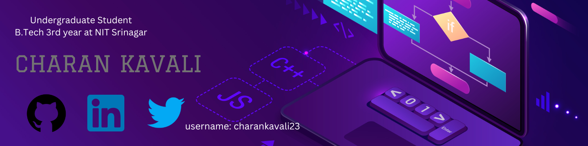

<h2>Hi there 👋</h2>
I'm Kavali Charan!
- I am a programming enthusiast undergraduate student, currently pursuing B.Tech 3rd year in CSE at NIT Srinagar.
- I am a Competitive Programmer(C++) with 2⭐ in codechef and solved 200+ problems in CodeChef, LeetCode and Hackerrank.
- Having good problem solving skills. Skilled in Data Structures and Algorithams.

- [CodeChef](https://www.codechef.com/users/charankavali23)
- [LeetCode](https://leetcode.com/charankavali23)

<h2>Skills I have 👨‍💻:</h2>

- Languages: C/C++ (Proficient), Python, JavaScript(learning)
- Frontend: HTML, CSS, JavaScript
- Database: SQL
- Developer Tools: VS Code, MS Office, Git, Git Hub
- Data Structures and Algorithms, DBMS, OOPS and Operating System

<h2>Projects I have done 📄:</h2>

- Developed a Gaming Console | C++
- 1.Tic Toc Toe 2.Snake And Ladder
- Sorting Visualizer | C++ using SDL
- Visualized Selection Sort, Bubble Sort, Insertion Sort, Merge Sort, Quick Sort and Heap Sort
  

<h2>How to contact me 📫:</h2>

- <a href="mailto:charankavali2309@gmail.com">charankavali2309@gmail.com</a>
- <a href="https://www.linkedin.com/in/charankavali23">Linkedin</a>
